final project
================
Yuchen Zhang
2022-12-12

### Distribution of Data

``` r
Body_df = readxl::read_excel("data/body_density_data.xlsx")
summary(Body_df)
```

    ##        id         bodyfat_brozek   bodyfat_siri    body_density  
    ##  Min.   :  1.00   Min.   : 0.00   Min.   : 0.00   Min.   :0.995  
    ##  1st Qu.: 63.75   1st Qu.:12.80   1st Qu.:12.47   1st Qu.:1.041  
    ##  Median :126.50   Median :19.00   Median :19.20   Median :1.055  
    ##  Mean   :126.50   Mean   :18.94   Mean   :19.15   Mean   :1.056  
    ##  3rd Qu.:189.25   3rd Qu.:24.60   3rd Qu.:25.30   3rd Qu.:1.070  
    ##  Max.   :252.00   Max.   :45.10   Max.   :47.50   Max.   :1.109  
    ##       age            weight          height           neck      
    ##  Min.   :22.00   Min.   :118.5   Min.   :64.00   Min.   :31.10  
    ##  1st Qu.:35.75   1st Qu.:159.0   1st Qu.:68.25   1st Qu.:36.40  
    ##  Median :43.00   Median :176.5   Median :70.00   Median :38.00  
    ##  Mean   :44.88   Mean   :178.9   Mean   :70.31   Mean   :37.99  
    ##  3rd Qu.:54.00   3rd Qu.:197.0   3rd Qu.:72.25   3rd Qu.:39.42  
    ##  Max.   :81.00   Max.   :363.1   Max.   :77.75   Max.   :51.20  
    ##      chest           abdomen            hip            thigh      
    ##  Min.   : 79.30   Min.   : 69.40   Min.   : 85.0   Min.   :47.20  
    ##  1st Qu.: 94.35   1st Qu.: 84.58   1st Qu.: 95.5   1st Qu.:56.00  
    ##  Median : 99.65   Median : 90.95   Median : 99.3   Median :59.00  
    ##  Mean   :100.82   Mean   : 92.56   Mean   : 99.9   Mean   :59.41  
    ##  3rd Qu.:105.38   3rd Qu.: 99.33   3rd Qu.:103.5   3rd Qu.:62.35  
    ##  Max.   :136.20   Max.   :148.10   Max.   :147.7   Max.   :87.30  
    ##       knee           ankle          bicep          forearm          wrist      
    ##  Min.   :33.00   Min.   :19.1   Min.   :24.80   Min.   :21.00   Min.   :15.80  
    ##  1st Qu.:36.98   1st Qu.:22.0   1st Qu.:30.20   1st Qu.:27.30   1st Qu.:17.60  
    ##  Median :38.50   Median :22.8   Median :32.05   Median :28.70   Median :18.30  
    ##  Mean   :38.59   Mean   :23.1   Mean   :32.27   Mean   :28.66   Mean   :18.23  
    ##  3rd Qu.:39.92   3rd Qu.:24.0   3rd Qu.:34.33   3rd Qu.:30.00   3rd Qu.:18.80  
    ##  Max.   :49.10   Max.   :33.9   Max.   :45.00   Max.   :34.90   Max.   :21.40

``` r
ggplot(Body_df, aes(x = bodyfat_brozek)) + 
 geom_histogram(aes(y = ..density..), color = "white", fill = "blue",binwidth = 1) +
 geom_density(alpha = .2) +
 labs(title = "Distributions of body fat measured in Brozek method")
```

    ## Warning: The dot-dot notation (`..density..`) was deprecated in ggplot2 3.4.0.
    ## ℹ Please use `after_stat(density)` instead.

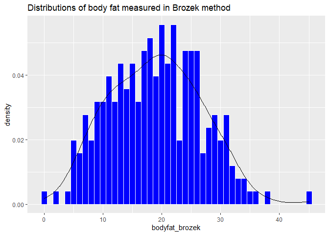<!-- -->

``` r
colnames = colnames(Body_df)

for (i in 5:17) {
  plot = 
ggplot(Body_df, aes_string(x = colnames[i])) + 
 geom_histogram(aes(y = ..density..), color = "white", fill = "blue",binwidth = 1) + 
 geom_density(alpha = .2) +
 labs(title = sprintf("Distributions of %s", colnames[i]) )
  
  print(plot)
}
```

    ## Warning: `aes_string()` was deprecated in ggplot2 3.0.0.
    ## ℹ Please use tidy evaluation ideoms with `aes()`

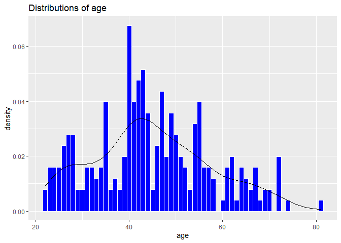<!-- -->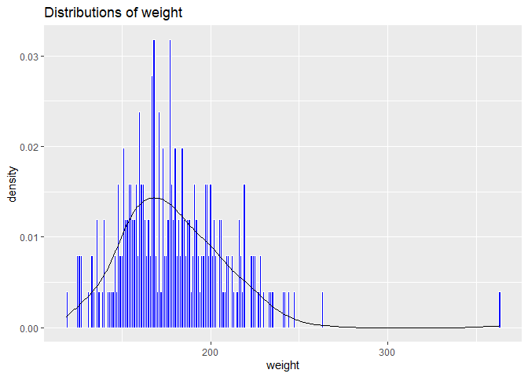<!-- -->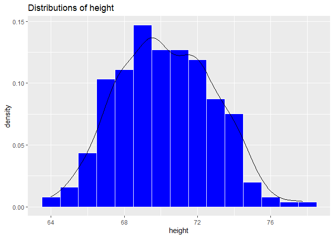<!-- -->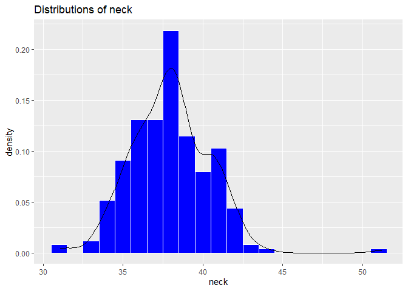<!-- -->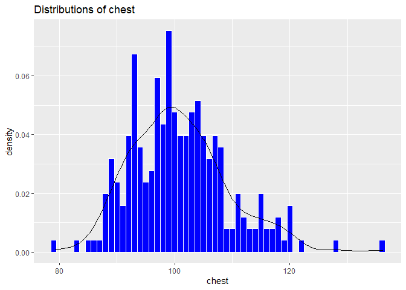<!-- -->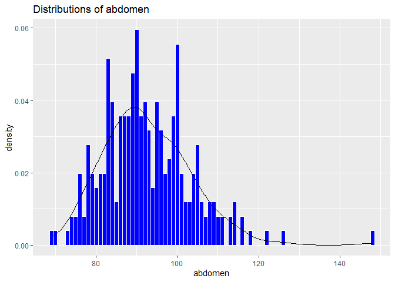<!-- -->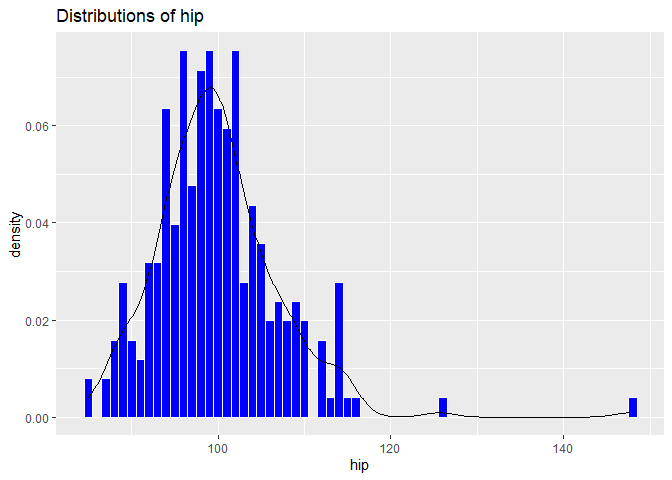<!-- -->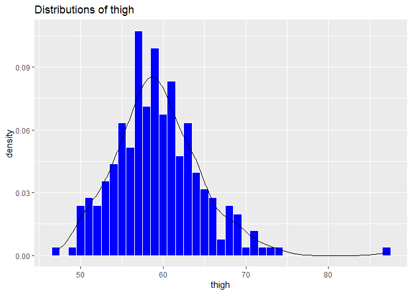<!-- -->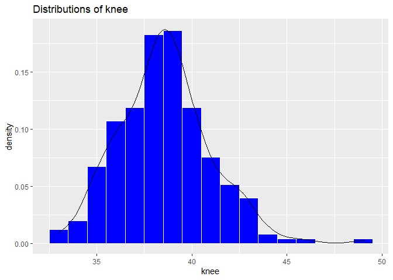<!-- -->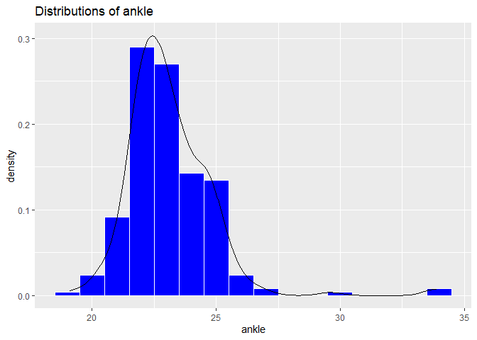<!-- -->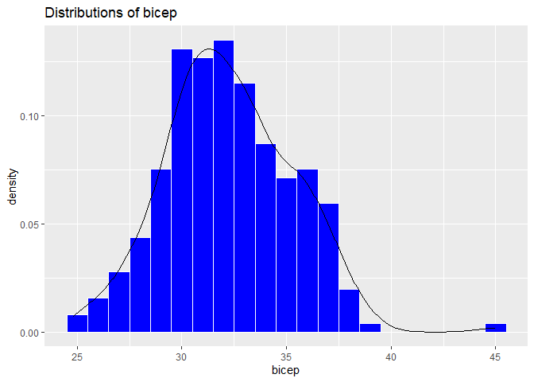<!-- -->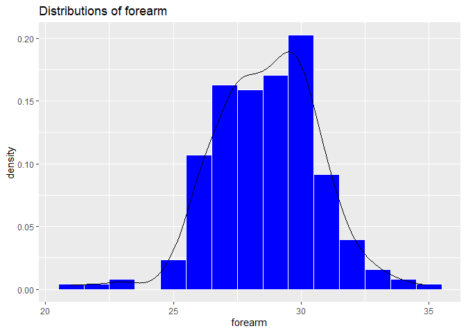<!-- -->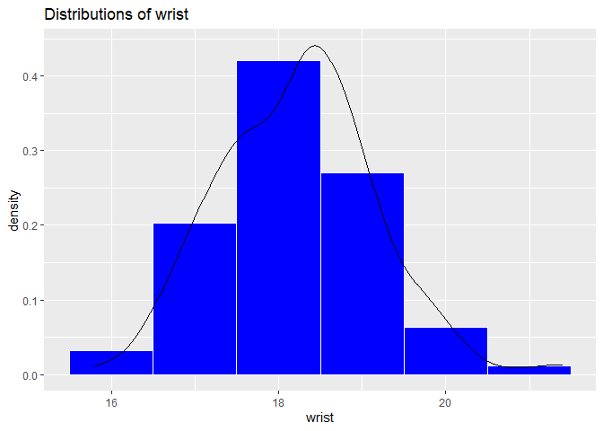<!-- -->

``` r
for (i in 5:17) {
  plot = 
  Body_df %>% 
    ggplot(aes_string(x = colnames[i], y = "bodyfat_brozek")) + geom_point() + geom_smooth(method = 'lm', se = TRUE, color = 'red') +
    labs(title = sprintf("Scatter plot for body fat against %s", colnames[i]) ) +
    ylab("Body Fat (Brozek)")
  
  print(plot)
}
```

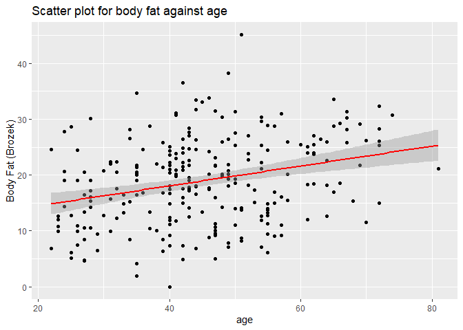<!-- -->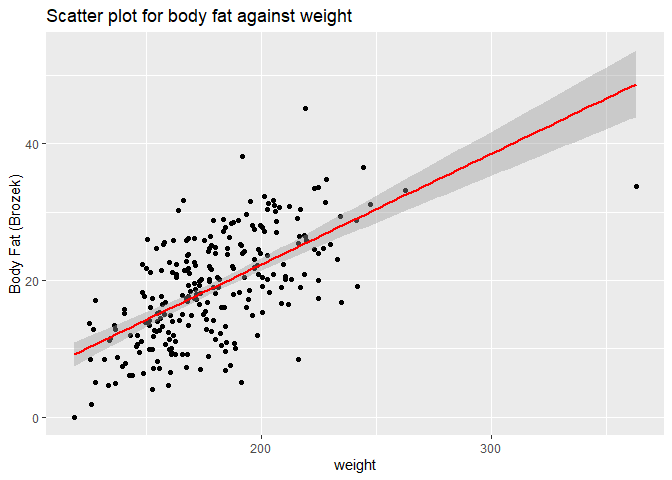<!-- -->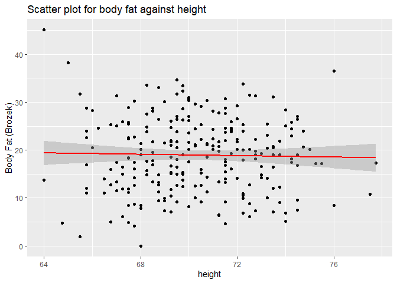<!-- -->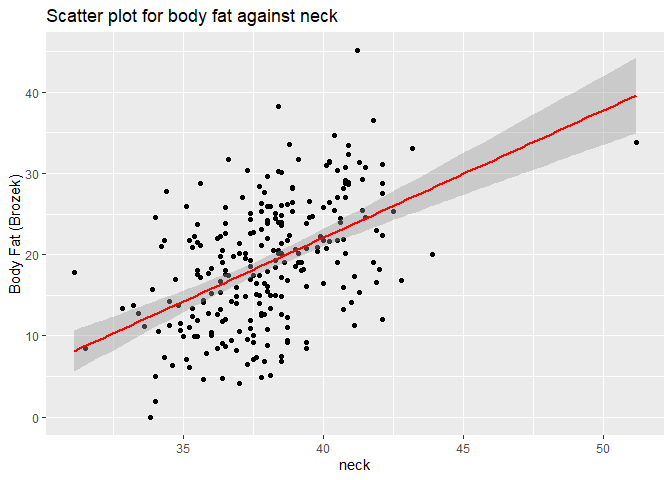<!-- -->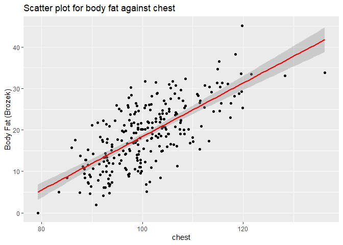<!-- -->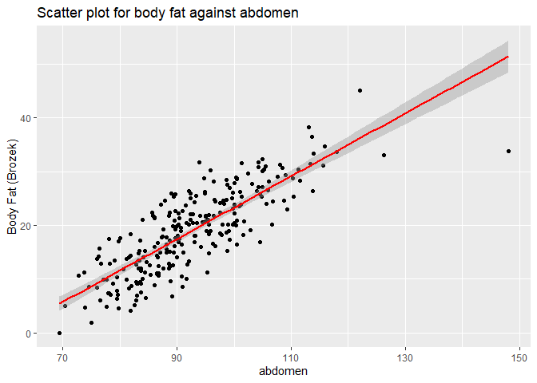<!-- -->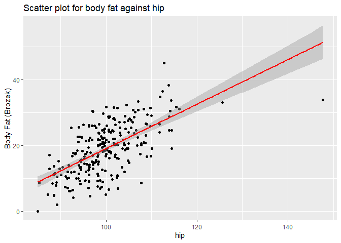<!-- -->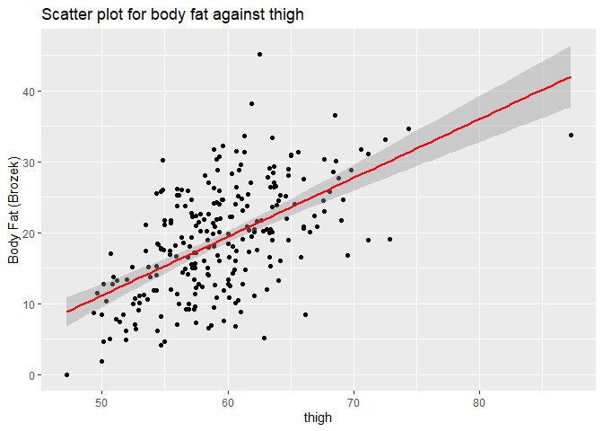<!-- -->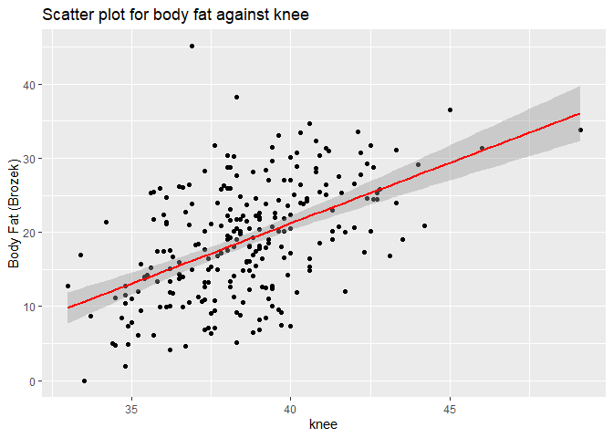<!-- -->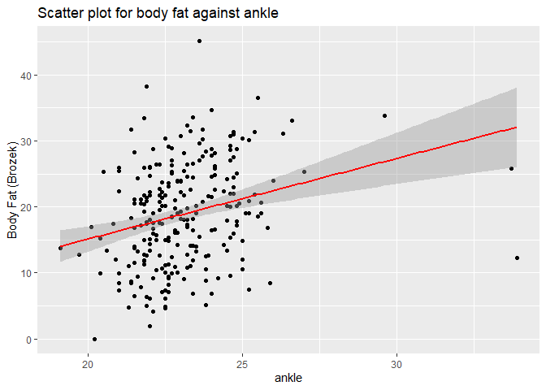<!-- -->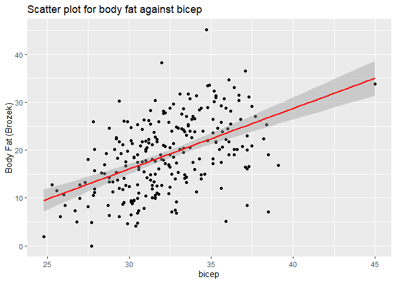<!-- -->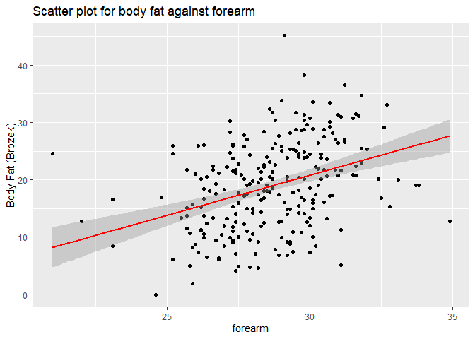<!-- -->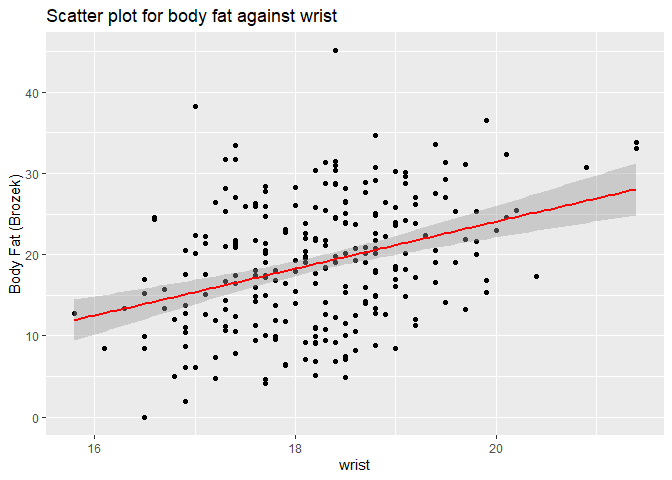<!-- -->

``` r
bodyfat_selected = 
  Body_df %>% 
  dplyr::select(-id,-bodyfat_siri,-body_density)
```

## Linear Regression

All the variables are normal and required no transformation. Based the
variables’ we selected, let’s firstly fit all them into a MLR model.

``` r
multifit = lm(bodyfat_brozek ~ ., data = bodyfat_selected)
```

### Automatic Selection

Backward Elmination

``` r
step(multifit, direction = "backward")
```

    ## Start:  AIC=711.28
    ## bodyfat_brozek ~ age + weight + height + neck + chest + abdomen + 
    ##     hip + thigh + knee + ankle + bicep + forearm + wrist
    ## 
    ##           Df Sum of Sq    RSS    AIC
    ## - knee     1      0.06 3792.8 709.28
    ## - chest    1      0.48 3793.2 709.31
    ## - height   1      0.79 3793.5 709.33
    ## - ankle    1     10.54 3803.3 709.98
    ## - bicep    1     14.79 3807.5 710.26
    ## - hip      1     28.74 3821.5 711.18
    ## <none>                 3792.7 711.28
    ## - weight   1     38.08 3830.8 711.79
    ## - thigh    1     51.79 3844.5 712.69
    ## - age      1     62.72 3855.5 713.41
    ## - neck     1     65.15 3857.9 713.57
    ## - forearm  1     88.02 3880.8 715.06
    ## - wrist    1    148.65 3941.4 718.96
    ## - abdomen  1   1794.28 5587.0 806.89
    ## 
    ## Step:  AIC=709.28
    ## bodyfat_brozek ~ age + weight + height + neck + chest + abdomen + 
    ##     hip + thigh + ankle + bicep + forearm + wrist
    ## 
    ##           Df Sum of Sq    RSS    AIC
    ## - chest    1      0.47 3793.3 707.31
    ## - height   1      0.94 3793.7 707.34
    ## - ankle    1     10.60 3803.4 707.98
    ## - bicep    1     14.92 3807.7 708.27
    ## - hip      1     29.07 3821.9 709.20
    ## <none>                 3792.8 709.28
    ## - weight   1     38.83 3831.6 709.85
    ## - thigh    1     56.03 3848.8 710.98
    ## - neck     1     65.52 3858.3 711.60
    ## - age      1     65.97 3858.8 711.63
    ## - forearm  1     88.24 3881.0 713.08
    ## - wrist    1    149.92 3942.7 717.05
    ## - abdomen  1   1794.44 5587.2 804.90
    ## 
    ## Step:  AIC=707.31
    ## bodyfat_brozek ~ age + weight + height + neck + abdomen + hip + 
    ##     thigh + ankle + bicep + forearm + wrist
    ## 
    ##           Df Sum of Sq    RSS    AIC
    ## - height   1      0.60 3793.9 705.35
    ## - ankle    1     10.88 3804.2 706.03
    ## - bicep    1     14.72 3808.0 706.29
    ## - hip      1     28.75 3822.0 707.22
    ## <none>                 3793.3 707.31
    ## - weight   1     55.78 3849.1 708.99
    ## - thigh    1     60.97 3854.2 709.33
    ## - neck     1     65.36 3858.6 709.62
    ## - age      1     65.70 3859.0 709.64
    ## - forearm  1     87.98 3881.3 711.09
    ## - wrist    1    149.58 3942.9 715.06
    ## - abdomen  1   2024.09 5817.4 813.07
    ## 
    ## Step:  AIC=705.35
    ## bodyfat_brozek ~ age + weight + neck + abdomen + hip + thigh + 
    ##     ankle + bicep + forearm + wrist
    ## 
    ##           Df Sum of Sq    RSS    AIC
    ## - ankle    1     11.20 3805.1 704.09
    ## - bicep    1     16.21 3810.1 704.43
    ## - hip      1     28.16 3822.0 705.22
    ## <none>                 3793.9 705.35
    ## - thigh    1     63.66 3857.5 707.55
    ## - neck     1     65.45 3859.3 707.66
    ## - age      1     66.23 3860.1 707.71
    ## - forearm  1     88.14 3882.0 709.14
    ## - weight   1    102.94 3896.8 710.10
    ## - wrist    1    151.52 3945.4 713.22
    ## - abdomen  1   2737.19 6531.1 840.23
    ## 
    ## Step:  AIC=704.09
    ## bodyfat_brozek ~ age + weight + neck + abdomen + hip + thigh + 
    ##     bicep + forearm + wrist
    ## 
    ##           Df Sum of Sq    RSS    AIC
    ## - bicep    1     14.91 3820.0 703.08
    ## - hip      1     29.32 3834.4 704.03
    ## <none>                 3805.1 704.09
    ## - age      1     63.17 3868.2 706.24
    ## - thigh    1     66.76 3871.8 706.48
    ## - neck     1     74.16 3879.2 706.96
    ## - forearm  1     87.57 3892.6 707.83
    ## - weight   1     92.42 3897.5 708.14
    ## - wrist    1    140.36 3945.4 711.22
    ## - abdomen  1   2740.72 6545.8 838.80
    ## 
    ## Step:  AIC=703.08
    ## bodyfat_brozek ~ age + weight + neck + abdomen + hip + thigh + 
    ##     forearm + wrist
    ## 
    ##           Df Sum of Sq    RSS    AIC
    ## <none>                 3820.0 703.08
    ## - hip      1     33.23 3853.2 703.26
    ## - neck     1     67.79 3887.8 705.51
    ## - age      1     67.88 3887.9 705.52
    ## - weight   1     81.50 3901.5 706.40
    ## - thigh    1     90.34 3910.3 706.97
    ## - forearm  1    122.99 3943.0 709.07
    ## - wrist    1    139.46 3959.4 710.12
    ## - abdomen  1   2726.49 6546.5 836.83

    ## 
    ## Call:
    ## lm(formula = bodyfat_brozek ~ age + weight + neck + abdomen + 
    ##     hip + thigh + forearm + wrist, data = bodyfat_selected)
    ## 
    ## Coefficients:
    ## (Intercept)          age       weight         neck      abdomen          hip  
    ##   -20.06213      0.05922     -0.08414     -0.43189      0.87721     -0.18641  
    ##       thigh      forearm        wrist  
    ##     0.28644      0.48255     -1.40487

The Final model obtained from Backward Elimination is **lm(formula =
bodyfat_brozek \~ age + weight + neck + abdomen + hip + thigh +
forearm + wrist, data = bodyfat_selected)**

Forward selection

``` r
intercept_only = lm(bodyfat_brozek ~ 1, data = bodyfat_selected)
step(intercept_only, direction = "forward", scope = formula(multifit))
```

    ## Start:  AIC=1033.09
    ## bodyfat_brozek ~ 1
    ## 
    ##           Df Sum of Sq     RSS     AIC
    ## + abdomen  1    9984.1  5094.9  761.66
    ## + chest    1    7449.8  7629.3  863.40
    ## + hip      1    5903.4  9175.6  909.91
    ## + weight   1    5669.1  9409.9  916.26
    ## + thigh    1    4750.5 10328.5  939.74
    ## + knee     1    3888.1 11190.9  959.94
    ## + bicep    1    3665.4 11413.6  964.91
    ## + neck     1    3642.5 11436.5  965.41
    ## + forearm  1    1990.0 13089.0  999.43
    ## + wrist    1    1821.6 13257.4 1002.65
    ## + age      1    1260.9 13818.1 1013.08
    ## + ankle    1    1073.2 14005.8 1016.49
    ## <none>                 15079.0 1033.09
    ## + height   1       9.1 15069.9 1034.94
    ## 
    ## Step:  AIC=761.66
    ## bodyfat_brozek ~ abdomen
    ## 
    ##           Df Sum of Sq    RSS    AIC
    ## + weight   1    853.60 4241.3 717.45
    ## + wrist    1    601.95 4493.0 731.97
    ## + neck     1    521.22 4573.7 736.46
    ## + height   1    500.85 4594.1 737.58
    ## + hip      1    467.43 4627.5 739.41
    ## + knee     1    279.91 4815.0 749.42
    ## + ankle    1    197.47 4897.5 753.70
    ## + chest    1    167.55 4927.4 755.23
    ## + age      1    164.67 4930.3 755.38
    ## + thigh    1    142.97 4952.0 756.48
    ## + bicep    1    117.61 4977.3 757.77
    ## + forearm  1     43.24 5051.7 761.51
    ## <none>                 5094.9 761.66
    ## 
    ## Step:  AIC=717.45
    ## bodyfat_brozek ~ abdomen + weight
    ## 
    ##           Df Sum of Sq    RSS    AIC
    ## + wrist    1   133.146 4108.2 711.41
    ## + thigh    1    74.090 4167.2 715.01
    ## + neck     1    73.386 4167.9 715.05
    ## + forearm  1    60.592 4180.7 715.82
    ## + bicep    1    52.085 4189.2 716.33
    ## <none>                 4241.3 717.45
    ## + knee     1     6.356 4235.0 719.07
    ## + height   1     6.285 4235.0 719.07
    ## + age      1     2.416 4238.9 719.30
    ## + ankle    1     1.369 4240.0 719.37
    ## + chest    1     0.024 4241.3 719.45
    ## + hip      1     0.013 4241.3 719.45
    ## 
    ## Step:  AIC=711.41
    ## bodyfat_brozek ~ abdomen + weight + wrist
    ## 
    ##           Df Sum of Sq    RSS    AIC
    ## + forearm  1   113.872 3994.3 706.33
    ## + bicep    1    72.826 4035.4 708.90
    ## + thigh    1    38.053 4070.1 711.06
    ## <none>                 4108.2 711.41
    ## + neck     1    21.188 4087.0 712.11
    ## + age      1    15.435 4092.7 712.46
    ## + knee     1    14.604 4093.6 712.51
    ## + ankle    1    12.957 4095.2 712.61
    ## + hip      1     8.100 4100.1 712.91
    ## + height   1     5.114 4103.1 713.10
    ## + chest    1     0.942 4107.2 713.35
    ## 
    ## Step:  AIC=706.33
    ## bodyfat_brozek ~ abdomen + weight + wrist + forearm
    ## 
    ##          Df Sum of Sq    RSS    AIC
    ## + neck    1    43.683 3950.6 705.55
    ## <none>                3994.3 706.33
    ## + age     1    29.483 3964.8 706.46
    ## + bicep   1    26.140 3968.2 706.67
    ## + thigh   1    25.904 3968.4 706.69
    ## + ankle   1    15.757 3978.6 707.33
    ## + knee    1    14.034 3980.3 707.44
    ## + hip     1     3.071 3991.2 708.13
    ## + height  1     1.434 3992.9 708.24
    ## + chest   1     0.560 3993.8 708.29
    ## 
    ## Step:  AIC=705.55
    ## bodyfat_brozek ~ abdomen + weight + wrist + forearm + neck
    ## 
    ##          Df Sum of Sq    RSS    AIC
    ## + age     1    37.251 3913.4 705.17
    ## + bicep   1    35.937 3914.7 705.25
    ## <none>                3950.6 705.55
    ## + thigh   1    23.995 3926.6 706.02
    ## + hip     1     9.494 3941.1 706.95
    ## + ankle   1     9.297 3941.3 706.96
    ## + knee    1     6.780 3943.8 707.12
    ## + height  1     5.684 3944.9 707.19
    ## + chest   1     0.000 3950.6 707.55
    ## 
    ## Step:  AIC=705.17
    ## bodyfat_brozek ~ abdomen + weight + wrist + forearm + neck + 
    ##     age
    ## 
    ##          Df Sum of Sq    RSS    AIC
    ## + thigh   1    60.163 3853.2 703.26
    ## + bicep   1    37.661 3875.7 704.73
    ## <none>                3913.4 705.17
    ## + ankle   1    12.670 3900.7 706.35
    ## + height  1     7.835 3905.5 706.66
    ## + knee    1     4.067 3909.3 706.91
    ## + hip     1     3.050 3910.3 706.97
    ## + chest   1     0.826 3912.6 707.11
    ## 
    ## Step:  AIC=703.26
    ## bodyfat_brozek ~ abdomen + weight + wrist + forearm + neck + 
    ##     age + thigh
    ## 
    ##          Df Sum of Sq    RSS    AIC
    ## + hip     1    33.229 3820.0 703.08
    ## <none>                3853.2 703.26
    ## + bicep   1    18.816 3834.4 704.03
    ## + ankle   1    10.913 3842.3 704.55
    ## + height  1     0.676 3852.5 705.22
    ## + chest   1     0.607 3852.6 705.22
    ## + knee    1     0.223 3853.0 705.25
    ## 
    ## Step:  AIC=703.08
    ## bodyfat_brozek ~ abdomen + weight + wrist + forearm + neck + 
    ##     age + thigh + hip
    ## 
    ##          Df Sum of Sq    RSS    AIC
    ## <none>                3820.0 703.08
    ## + bicep   1   14.9103 3805.1 704.09
    ## + ankle   1    9.9018 3810.1 704.43
    ## + height  1    2.5369 3817.4 704.91
    ## + knee    1    0.0583 3819.9 705.08
    ## + chest   1    0.0036 3820.0 705.08

    ## 
    ## Call:
    ## lm(formula = bodyfat_brozek ~ abdomen + weight + wrist + forearm + 
    ##     neck + age + thigh + hip, data = bodyfat_selected)
    ## 
    ## Coefficients:
    ## (Intercept)      abdomen       weight        wrist      forearm         neck  
    ##   -20.06213      0.87721     -0.08414     -1.40487      0.48255     -0.43189  
    ##         age        thigh          hip  
    ##     0.05922      0.28644     -0.18641

The model obtained from Forward Selection is **lm(formula =
bodyfat_brozek \~ abdomen + weight + wrist + forearm + neck + age +
thigh + hip, data = bodyfat_selected)**

Stepwise Selection

``` r
step(multifit, direction = "both")
```

    ## Start:  AIC=711.28
    ## bodyfat_brozek ~ age + weight + height + neck + chest + abdomen + 
    ##     hip + thigh + knee + ankle + bicep + forearm + wrist
    ## 
    ##           Df Sum of Sq    RSS    AIC
    ## - knee     1      0.06 3792.8 709.28
    ## - chest    1      0.48 3793.2 709.31
    ## - height   1      0.79 3793.5 709.33
    ## - ankle    1     10.54 3803.3 709.98
    ## - bicep    1     14.79 3807.5 710.26
    ## - hip      1     28.74 3821.5 711.18
    ## <none>                 3792.7 711.28
    ## - weight   1     38.08 3830.8 711.79
    ## - thigh    1     51.79 3844.5 712.69
    ## - age      1     62.72 3855.5 713.41
    ## - neck     1     65.15 3857.9 713.57
    ## - forearm  1     88.02 3880.8 715.06
    ## - wrist    1    148.65 3941.4 718.96
    ## - abdomen  1   1794.28 5587.0 806.89
    ## 
    ## Step:  AIC=709.28
    ## bodyfat_brozek ~ age + weight + height + neck + chest + abdomen + 
    ##     hip + thigh + ankle + bicep + forearm + wrist
    ## 
    ##           Df Sum of Sq    RSS    AIC
    ## - chest    1      0.47 3793.3 707.31
    ## - height   1      0.94 3793.7 707.34
    ## - ankle    1     10.60 3803.4 707.98
    ## - bicep    1     14.92 3807.7 708.27
    ## - hip      1     29.07 3821.9 709.20
    ## <none>                 3792.8 709.28
    ## - weight   1     38.83 3831.6 709.85
    ## - thigh    1     56.03 3848.8 710.98
    ## + knee     1      0.06 3792.7 711.28
    ## - neck     1     65.52 3858.3 711.60
    ## - age      1     65.97 3858.8 711.63
    ## - forearm  1     88.24 3881.0 713.08
    ## - wrist    1    149.92 3942.7 717.05
    ## - abdomen  1   1794.44 5587.2 804.90
    ## 
    ## Step:  AIC=707.31
    ## bodyfat_brozek ~ age + weight + height + neck + abdomen + hip + 
    ##     thigh + ankle + bicep + forearm + wrist
    ## 
    ##           Df Sum of Sq    RSS    AIC
    ## - height   1      0.60 3793.9 705.35
    ## - ankle    1     10.88 3804.2 706.03
    ## - bicep    1     14.72 3808.0 706.29
    ## - hip      1     28.75 3822.0 707.22
    ## <none>                 3793.3 707.31
    ## - weight   1     55.78 3849.1 708.99
    ## + chest    1      0.47 3792.8 709.28
    ## + knee     1      0.05 3793.2 709.31
    ## - thigh    1     60.97 3854.2 709.33
    ## - neck     1     65.36 3858.6 709.62
    ## - age      1     65.70 3859.0 709.64
    ## - forearm  1     87.98 3881.3 711.09
    ## - wrist    1    149.58 3942.9 715.06
    ## - abdomen  1   2024.09 5817.4 813.07
    ## 
    ## Step:  AIC=705.35
    ## bodyfat_brozek ~ age + weight + neck + abdomen + hip + thigh + 
    ##     ankle + bicep + forearm + wrist
    ## 
    ##           Df Sum of Sq    RSS    AIC
    ## - ankle    1     11.20 3805.1 704.09
    ## - bicep    1     16.21 3810.1 704.43
    ## - hip      1     28.16 3822.0 705.22
    ## <none>                 3793.9 705.35
    ## + height   1      0.60 3793.3 707.31
    ## + knee     1      0.17 3793.7 707.34
    ## + chest    1      0.13 3793.7 707.34
    ## - thigh    1     63.66 3857.5 707.55
    ## - neck     1     65.45 3859.3 707.66
    ## - age      1     66.23 3860.1 707.71
    ## - forearm  1     88.14 3882.0 709.14
    ## - weight   1    102.94 3896.8 710.10
    ## - wrist    1    151.52 3945.4 713.22
    ## - abdomen  1   2737.19 6531.1 840.23
    ## 
    ## Step:  AIC=704.09
    ## bodyfat_brozek ~ age + weight + neck + abdomen + hip + thigh + 
    ##     bicep + forearm + wrist
    ## 
    ##           Df Sum of Sq    RSS    AIC
    ## - bicep    1     14.91 3820.0 703.08
    ## - hip      1     29.32 3834.4 704.03
    ## <none>                 3805.1 704.09
    ## + ankle    1     11.20 3793.9 705.35
    ## + height   1      0.92 3804.2 706.03
    ## + chest    1      0.22 3804.9 706.08
    ## + knee     1      0.02 3805.1 706.09
    ## - age      1     63.17 3868.2 706.24
    ## - thigh    1     66.76 3871.8 706.48
    ## - neck     1     74.16 3879.2 706.96
    ## - forearm  1     87.57 3892.6 707.83
    ## - weight   1     92.42 3897.5 708.14
    ## - wrist    1    140.36 3945.4 711.22
    ## - abdomen  1   2740.72 6545.8 838.80
    ## 
    ## Step:  AIC=703.08
    ## bodyfat_brozek ~ age + weight + neck + abdomen + hip + thigh + 
    ##     forearm + wrist
    ## 
    ##           Df Sum of Sq    RSS    AIC
    ## <none>                 3820.0 703.08
    ## - hip      1     33.23 3853.2 703.26
    ## + bicep    1     14.91 3805.1 704.09
    ## + ankle    1      9.90 3810.1 704.43
    ## + height   1      2.54 3817.4 704.91
    ## + knee     1      0.06 3819.9 705.08
    ## + chest    1      0.00 3820.0 705.08
    ## - neck     1     67.79 3887.8 705.51
    ## - age      1     67.88 3887.9 705.52
    ## - weight   1     81.50 3901.5 706.40
    ## - thigh    1     90.34 3910.3 706.97
    ## - forearm  1    122.99 3943.0 709.07
    ## - wrist    1    139.46 3959.4 710.12
    ## - abdomen  1   2726.49 6546.5 836.83

    ## 
    ## Call:
    ## lm(formula = bodyfat_brozek ~ age + weight + neck + abdomen + 
    ##     hip + thigh + forearm + wrist, data = bodyfat_selected)
    ## 
    ## Coefficients:
    ## (Intercept)          age       weight         neck      abdomen          hip  
    ##   -20.06213      0.05922     -0.08414     -0.43189      0.87721     -0.18641  
    ##       thigh      forearm        wrist  
    ##     0.28644      0.48255     -1.40487

The stepwise selection from both side get us the model to be
**lm(formula = bodyfat_brozek \~ age + weight + neck + abdomen + hip +
thigh + forearm + wrist, data = bodyfat_selected)**

From the procedures we done above, the fianl model was agreed to be
**lm(formula = bodyfat_brozek \~ age + weight + neck + abdomen + hip +
thigh + forearm + wrist, data = bodyfat_selected)**

### Tested Based Procedures

Then, let’s try Tested Based Procedures “Cp test”

``` r
mat = as.matrix(bodyfat_selected)
leaps(x = mat[,2:14], y = mat[,1], nbest = 1, method = "Cp")
```

    ## $which
    ##        1     2     3     4     5    6     7     8     9     A     B     C     D
    ## 1  FALSE FALSE FALSE FALSE FALSE TRUE FALSE FALSE FALSE FALSE FALSE FALSE FALSE
    ## 2  FALSE  TRUE FALSE FALSE FALSE TRUE FALSE FALSE FALSE FALSE FALSE FALSE FALSE
    ## 3  FALSE  TRUE FALSE FALSE FALSE TRUE FALSE FALSE FALSE FALSE FALSE FALSE  TRUE
    ## 4  FALSE  TRUE FALSE FALSE FALSE TRUE FALSE FALSE FALSE FALSE FALSE  TRUE  TRUE
    ## 5  FALSE  TRUE FALSE  TRUE FALSE TRUE FALSE FALSE FALSE FALSE FALSE  TRUE  TRUE
    ## 6   TRUE  TRUE FALSE FALSE FALSE TRUE FALSE  TRUE FALSE FALSE FALSE  TRUE  TRUE
    ## 7   TRUE  TRUE FALSE  TRUE FALSE TRUE FALSE  TRUE FALSE FALSE FALSE  TRUE  TRUE
    ## 8   TRUE  TRUE FALSE  TRUE FALSE TRUE  TRUE  TRUE FALSE FALSE FALSE  TRUE  TRUE
    ## 9   TRUE  TRUE FALSE  TRUE FALSE TRUE  TRUE  TRUE FALSE FALSE  TRUE  TRUE  TRUE
    ## 10  TRUE  TRUE FALSE  TRUE FALSE TRUE  TRUE  TRUE FALSE  TRUE  TRUE  TRUE  TRUE
    ## 11  TRUE  TRUE  TRUE  TRUE FALSE TRUE  TRUE  TRUE FALSE  TRUE  TRUE  TRUE  TRUE
    ## 12  TRUE  TRUE  TRUE  TRUE  TRUE TRUE  TRUE  TRUE FALSE  TRUE  TRUE  TRUE  TRUE
    ## 13  TRUE  TRUE  TRUE  TRUE  TRUE TRUE  TRUE  TRUE  TRUE  TRUE  TRUE  TRUE  TRUE
    ## 
    ## $label
    ##  [1] "(Intercept)" "1"           "2"           "3"           "4"          
    ##  [6] "5"           "6"           "7"           "8"           "9"          
    ## [11] "A"           "B"           "C"           "D"          
    ## 
    ## $size
    ##  [1]  2  3  4  5  6  7  8  9 10 11 12 13 14
    ## 
    ## $Cp
    ##  [1] 71.714227 20.149441 13.794362  8.648732  7.907567  7.079739  5.794727
    ##  [8]  5.709556  6.773916  8.070942 10.033504 12.003818 14.000000

The smallest Cp value we got indicate that best model: **lm(formula =
bodyfat_brozek \~ age + weight + neck + abdomen + hip + thigh +
forearm + wrist, data = bodyfat_selected)**

``` r
leaps(x = mat[,2:14], y = mat[,1], nbest = 1, method = "adjr2")
```

    ## $which
    ##        1     2     3     4     5    6     7     8     9     A     B     C     D
    ## 1  FALSE FALSE FALSE FALSE FALSE TRUE FALSE FALSE FALSE FALSE FALSE FALSE FALSE
    ## 2  FALSE  TRUE FALSE FALSE FALSE TRUE FALSE FALSE FALSE FALSE FALSE FALSE FALSE
    ## 3  FALSE  TRUE FALSE FALSE FALSE TRUE FALSE FALSE FALSE FALSE FALSE FALSE  TRUE
    ## 4  FALSE  TRUE FALSE FALSE FALSE TRUE FALSE FALSE FALSE FALSE FALSE  TRUE  TRUE
    ## 5  FALSE  TRUE FALSE  TRUE FALSE TRUE FALSE FALSE FALSE FALSE FALSE  TRUE  TRUE
    ## 6   TRUE  TRUE FALSE FALSE FALSE TRUE FALSE  TRUE FALSE FALSE FALSE  TRUE  TRUE
    ## 7   TRUE  TRUE FALSE  TRUE FALSE TRUE FALSE  TRUE FALSE FALSE FALSE  TRUE  TRUE
    ## 8   TRUE  TRUE FALSE  TRUE FALSE TRUE  TRUE  TRUE FALSE FALSE FALSE  TRUE  TRUE
    ## 9   TRUE  TRUE FALSE  TRUE FALSE TRUE  TRUE  TRUE FALSE FALSE  TRUE  TRUE  TRUE
    ## 10  TRUE  TRUE FALSE  TRUE FALSE TRUE  TRUE  TRUE FALSE  TRUE  TRUE  TRUE  TRUE
    ## 11  TRUE  TRUE  TRUE  TRUE FALSE TRUE  TRUE  TRUE FALSE  TRUE  TRUE  TRUE  TRUE
    ## 12  TRUE  TRUE  TRUE  TRUE  TRUE TRUE  TRUE  TRUE FALSE  TRUE  TRUE  TRUE  TRUE
    ## 13  TRUE  TRUE  TRUE  TRUE  TRUE TRUE  TRUE  TRUE  TRUE  TRUE  TRUE  TRUE  TRUE
    ## 
    ## $label
    ##  [1] "(Intercept)" "1"           "2"           "3"           "4"          
    ##  [6] "5"           "6"           "7"           "8"           "9"          
    ## [11] "A"           "B"           "C"           "D"          
    ## 
    ## $size
    ##  [1]  2  3  4  5  6  7  8  9 10 11 12 13 14
    ## 
    ## $adjr2
    ##  [1] 0.6607663 0.7164672 0.7242606 0.7308182 0.7326798 0.7346504 0.7371342
    ##  [8] 0.7383287 0.7382730 0.7379607 0.7369103 0.7358424 0.7347368

The largest adjusted R2 indicated the best subset to be: **lm(formula =
bodyfat_brozek \~ age + weight + neck + abdomen + hip + thigh +
forearm + wrist, data= bodyfat_selected)**

### LASSO

Let’s use corss validation to choose lambda

``` r
lambda_seq = 10^seq(-3, 0, by = 0.1)
set.seed(1)
cv_bodyfat = cv.glmnet(as.matrix(bodyfat_selected[2:14]), bodyfat_selected$bodyfat_brozek, lambda = lambda_seq, nfolds = 5)
cv_bodyfat
```

    ## 
    ## Call:  cv.glmnet(x = as.matrix(bodyfat_selected[2:14]), y = bodyfat_selected$bodyfat_brozek,      lambda = lambda_seq, nfolds = 5) 
    ## 
    ## Measure: Mean-Squared Error 
    ## 
    ##     Lambda Index Measure    SE Nonzero
    ## min 0.0794    12   17.84 1.396      10
    ## 1se 0.3981     5   19.08 1.377       4

The Lambda minimum is 0.0794. Then, let’s reun a LASSO regression using
this value.

``` r
lasso_fit = glmnet::glmnet(as.matrix(bodyfat_selected[2:14]), bodyfat_selected$bodyfat_brozek, lambda = cv_bodyfat$lambda.min)
coef(lasso_fit)
```

    ## 14 x 1 sparse Matrix of class "dgCMatrix"
    ##                      s0
    ## (Intercept) -1.67769700
    ## age          0.05514749
    ## weight      -0.02054796
    ## height      -0.20155437
    ## neck        -0.38477117
    ## chest        .         
    ## abdomen      0.73771943
    ## hip         -0.06809855
    ## thigh        0.07161926
    ## knee         .         
    ## ankle        .         
    ## bicep        0.03578887
    ## forearm      0.33796956
    ## wrist       -1.42446422

The final model obtained from LASSO is **lm(formula =bodyfat_brozek \~
age + weight + height + neck + abdomen + hip + thigh + bicep + forearm +
wrist, data = bodyfat_selected)**

### Model Validation

Since the lasso method incurs a different model, so we will adopt model
validation to choose the better model. First, use 5-fold validation and
create the training sets.

``` r
train = trainControl(method = "cv", number = 5)
```

Then, fit the lasso model.

``` r
model_lasso = train(bodyfat_brozek ~ age + weight + height + neck + abdomen + hip + thigh + bicep + forearm + wrist, 
                    data = bodyfat_selected,
                    trControl = train,
                    method = "lm",
                    na.action = na.pass)

model_lasso$finalModel
```

    ## 
    ## Call:
    ## lm(formula = .outcome ~ ., data = dat)
    ## 
    ## Coefficients:
    ## (Intercept)          age       weight       height         neck      abdomen  
    ##   -17.33529      0.05704     -0.08407     -0.03616     -0.46442      0.87175  
    ##         hip        thigh        bicep      forearm        wrist  
    ##    -0.18037      0.25097      0.14538      0.42760     -1.40328

``` r
print(model_lasso)
```

    ## Linear Regression 
    ## 
    ## 252 samples
    ##  10 predictor
    ## 
    ## No pre-processing
    ## Resampling: Cross-Validated (5 fold) 
    ## Summary of sample sizes: 203, 201, 201, 201, 202 
    ## Resampling results:
    ## 
    ##   RMSE      Rsquared   MAE     
    ##   4.025712  0.7345171  3.270656
    ## 
    ## Tuning parameter 'intercept' was held constant at a value of TRUE

RMSE for model_lasso is 4.077981; Rsquared is 0.7296759; MAE is
3.329993. Now, fit the test_based model.

``` r
model_test = train(bodyfat_brozek ~ age + weight + neck + abdomen + hip + thigh + forearm + wrist, 
                    data = bodyfat_selected,
                    trControl = train,
                    method = "lm",
                    na.action = na.pass)

model_test$finalModel
```

    ## 
    ## Call:
    ## lm(formula = .outcome ~ ., data = dat)
    ## 
    ## Coefficients:
    ## (Intercept)          age       weight         neck      abdomen          hip  
    ##   -20.06213      0.05922     -0.08414     -0.43189      0.87721     -0.18641  
    ##       thigh      forearm        wrist  
    ##     0.28644      0.48255     -1.40487

``` r
print(model_test)
```

    ## Linear Regression 
    ## 
    ## 252 samples
    ##   8 predictor
    ## 
    ## No pre-processing
    ## Resampling: Cross-Validated (5 fold) 
    ## Summary of sample sizes: 203, 202, 201, 200, 202 
    ## Resampling results:
    ## 
    ##   RMSE      Rsquared  MAE     
    ##   4.024887  0.738934  3.287117
    ## 
    ## Tuning parameter 'intercept' was held constant at a value of TRUE

RMSE for model_test is 4.078487; Rsquared is 0.7310717; MAE is 3.340266
Since the RMSE and MAE are slightly smaller in the lasso model, we would
slightly favor the lasso model. However, considering the principle of
parsimony, we will run ANOVA to further compare the two models.

### ANOVA for MLR

``` r
model_small = lm(bodyfat_brozek ~ age + weight + neck + abdomen + hip + thigh + forearm + wrist, 
                    data = bodyfat_selected)
model_large = lm(bodyfat_brozek ~ age + weight + height + neck + abdomen + hip + thigh + bicep + forearm + wrist, data = bodyfat_selected)

anova(model_small,model_large)
```

    ## Analysis of Variance Table
    ## 
    ## Model 1: bodyfat_brozek ~ age + weight + neck + abdomen + hip + thigh + 
    ##     forearm + wrist
    ## Model 2: bodyfat_brozek ~ age + weight + height + neck + abdomen + hip + 
    ##     thigh + bicep + forearm + wrist
    ##   Res.Df    RSS Df Sum of Sq      F Pr(>F)
    ## 1    243 3820.0                           
    ## 2    241 3804.2  2    15.833 0.5015 0.6062

F = 0.5015, p_value = 0.6062, we fail to reject H0 and conclude that the
larger model is not superior. Now, according to the principle of
parsimony, we will choose the small model.

``` r
model_final = model_small
summary(model_final)
```

    ## 
    ## Call:
    ## lm(formula = bodyfat_brozek ~ age + weight + neck + abdomen + 
    ##     hip + thigh + forearm + wrist, data = bodyfat_selected)
    ## 
    ## Residuals:
    ##      Min       1Q   Median       3Q      Max 
    ## -10.0574  -2.7411  -0.1912   2.6929   9.4977 
    ## 
    ## Coefficients:
    ##              Estimate Std. Error t value Pr(>|t|)    
    ## (Intercept) -20.06213   10.84654  -1.850  0.06558 .  
    ## age           0.05922    0.02850   2.078  0.03876 *  
    ## weight       -0.08414    0.03695  -2.277  0.02366 *  
    ## neck         -0.43189    0.20799  -2.077  0.03889 *  
    ## abdomen       0.87721    0.06661  13.170  < 2e-16 ***
    ## hip          -0.18641    0.12821  -1.454  0.14727    
    ## thigh         0.28644    0.11949   2.397  0.01727 *  
    ## forearm       0.48255    0.17251   2.797  0.00557 ** 
    ## wrist        -1.40487    0.47167  -2.978  0.00319 ** 
    ## ---
    ## Signif. codes:  0 '***' 0.001 '**' 0.01 '*' 0.05 '.' 0.1 ' ' 1
    ## 
    ## Residual standard error: 3.965 on 243 degrees of freedom
    ## Multiple R-squared:  0.7467, Adjusted R-squared:  0.7383 
    ## F-statistic: 89.53 on 8 and 243 DF,  p-value: < 2.2e-16

## Model Diagnostics

#### Residual vs Fitted & QQ Plots

Residual vs Fitted plot

``` r
plot(model_final, which = 1)
```

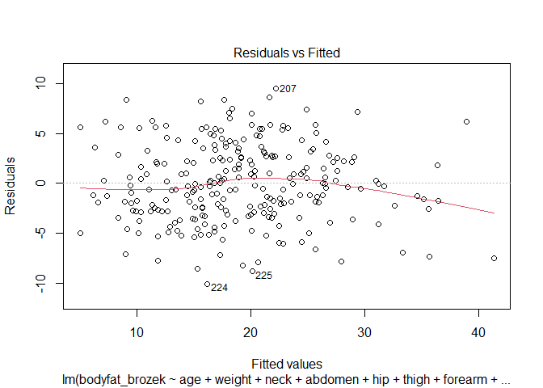<!-- -->
Heteroscedasticity is not detected.

QQ plot

``` r
plot(model_final, which = 2)
```

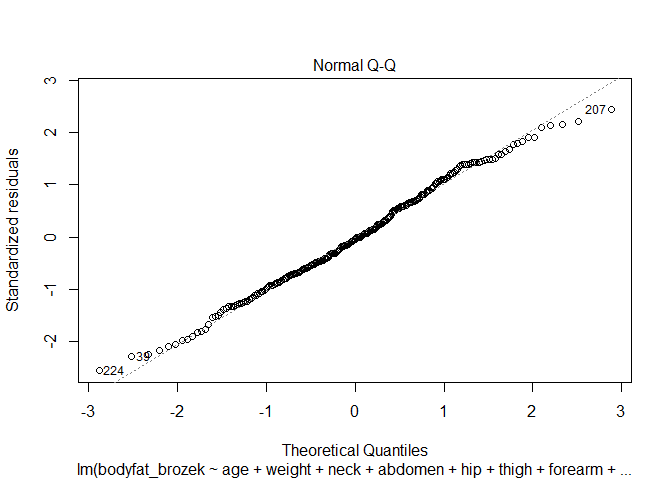<!-- -->
Residuals appear to be normal. No transformations needed.

#### Checking to Outliers and Influential Points

Residuals vs Leverage plot

``` r
plot(model_final, which = 4)
```

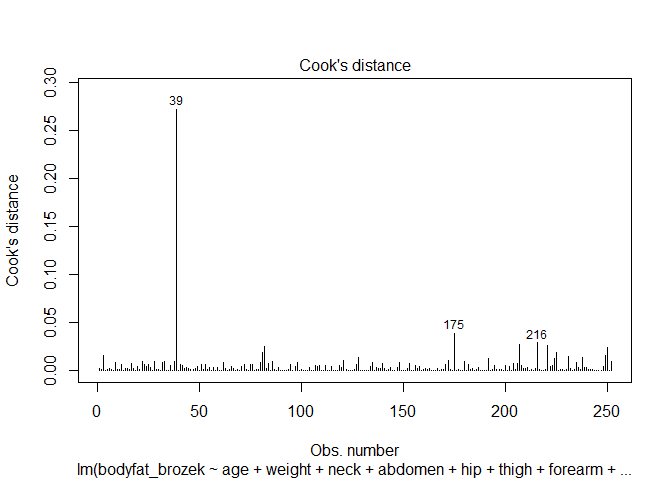<!-- -->
remove influential points and fit model without influential points

``` r
bodyfat_out = bodyfat_selected[-c(39,175,216),]

without = lm(bodyfat_brozek ~ age + weight + neck + abdomen + hip + thigh + forearm + wrist, 
                    data = bodyfat_out)
summary(without)
```

    ## 
    ## Call:
    ## lm(formula = bodyfat_brozek ~ age + weight + neck + abdomen + 
    ##     hip + thigh + forearm + wrist, data = bodyfat_out)
    ## 
    ## Residuals:
    ##    Min     1Q Median     3Q    Max 
    ## -9.914 -2.672 -0.292  2.732  9.647 
    ## 
    ## Coefficients:
    ##              Estimate Std. Error t value Pr(>|t|)    
    ## (Intercept) -19.89545   10.79552  -1.843  0.06657 .  
    ## age           0.07180    0.02874   2.498  0.01315 *  
    ## weight       -0.06634    0.03712  -1.787  0.07516 .  
    ## neck         -0.38057    0.21193  -1.796  0.07379 .  
    ## abdomen       0.82593    0.06857  12.045  < 2e-16 ***
    ## hip          -0.15267    0.13046  -1.170  0.24305    
    ## thigh         0.29204    0.12021   2.429  0.01586 *  
    ## forearm       0.41804    0.20776   2.012  0.04533 *  
    ## wrist        -1.56783    0.48022  -3.265  0.00126 ** 
    ## ---
    ## Signif. codes:  0 '***' 0.001 '**' 0.01 '*' 0.05 '.' 0.1 ' ' 1
    ## 
    ## Residual standard error: 3.924 on 240 degrees of freedom
    ## Multiple R-squared:  0.7385, Adjusted R-squared:  0.7298 
    ## F-statistic: 84.72 on 8 and 240 DF,  p-value: < 2.2e-16

check without diagnostics

``` r
plot(without)
```

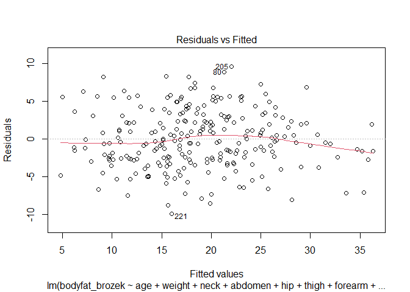<!-- -->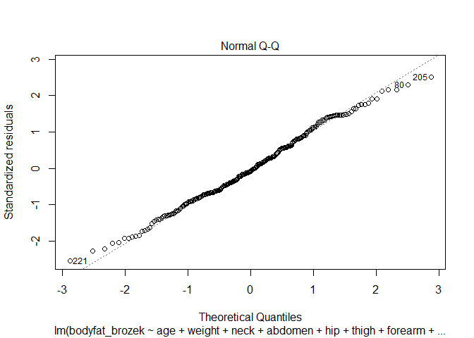<!-- -->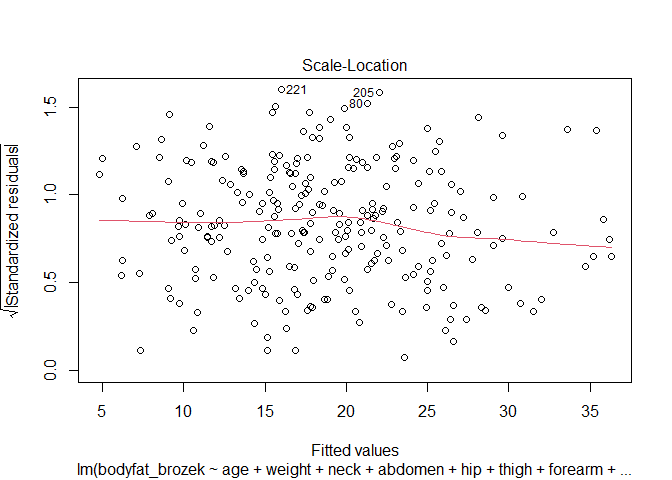<!-- -->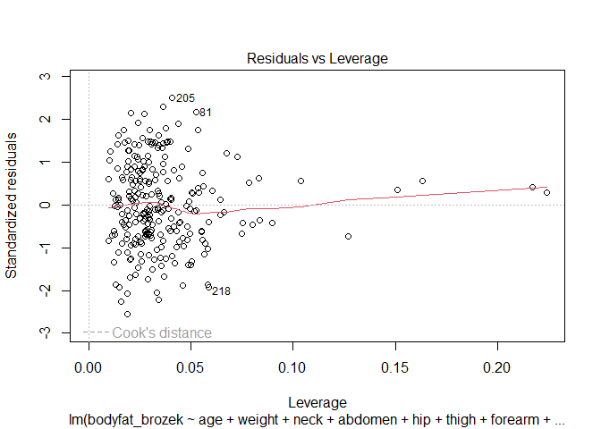<!-- -->

#### Assessing Multicollinearity
